<!-- ============ HEADER ============ -->

  

  

  
  
  
  
  

<!-- ============ TERMINAL INTRO ============ -->

  

---

## 🔁 How my systems move

  

> Most of my work lives in the parts users never see — cache layers, queues with retry and dead-letter handling, idempotent webhooks, row-level security — and the React screens that sit on top of them.

---

## 🧰 Tech stack

<table align="center">
  <tr>
    <td align="center" width="140"><b>Backend</b></td>
    <td></td>
  </tr>
  <tr>
    <td align="center"><b>Frontend</b></td>
    <td></td>
  </tr>
  <tr>
    <td align="center"><b>Data &amp; messaging</b></td>
    <td></td>
  </tr>
  <tr>
    <td align="center"><b>Cloud &amp; DevOps</b></td>
    <td></td>
  </tr>
  <tr>
    <td align="center"><b>AI &amp; integrations</b></td>
    <td>
      
      
      
      
      
      
    </td>
  </tr>
</table>

---

## 🚀 Things I've shipped

| | Project | What's inside |
|---|---|---|
| 🐎 | **[Sync Recruiting](https://syncrecruiting.net/)** | Equestrian hiring platform, built solo. Admin-curated matching, 8-language UI + user content via write-time DeepL pipeline, PostgreSQL RLS across 15 tables, email + in-app + push notifications, PDF resumes. |
| 🛒 | **Ojiyo** · [demo](https://drive.google.com/file/d/11KwXd5c-812hyNvfq3X940IFf6MsmyQb/view?usp=sharing) | Multi-vendor marketplace — grocery & food delivery, reels, real-time e-wallet, 5-level referral commissions, payment + delivery provider abstraction across 3 countries. |
| 🛍️ | **[Dastaan](https://www.dastaanlife.com/)** | Live e-commerce storefront — catalogue, cart, Stripe checkout, order management, admin dashboard. |
| 💬 | **Real-time Chat** · [demo](https://drive.google.com/file/d/18ZY_-DAdiOc_v-q40gFleP84Vc8upTMw/view?usp=sharing) | Socket.IO + Redis presence, sent/delivered/read receipts, optimistic messages, cursor pagination, virtualized list. |
| 📄 | **Intelli-Docs** | RAG-based document processing for HR — ingest, embed, retrieve, and answer over internal documents with an LLM. |
| 👗 | **Dress Genie** · [demo](https://drive.google.com/file/d/1usVkN7no9sxiIiIXMQ2V_2bA3nSBXqcV/view?usp=sharing) | AI virtual try-on, pose transfer and image generation — open-source models on GPU, orchestrated by Node.js. |

🏆 Winner — Visio Spark Web Development Hackathon (25 teams), COMSATS University Islamabad

---

## 📊 Activity

  
  

  

  

<!-- Snake eating the contribution graph — generated by .github/workflows/snake.yml -->

  <picture>
    <source media="(prefers-color-scheme: dark)" srcset="https://raw.githubusercontent.com/ali-hamza-jutt/ali-hamza-jutt/output/github-snake-dark.svg" />
    <source media="(prefers-color-scheme: light)" srcset="https://raw.githubusercontent.com/ali-hamza-jutt/ali-hamza-jutt/output/github-snake.svg" />
    
  </picture>

---

  <b>Open to full-time and contract work — backend, full stack, or AI-integrated products.</b> 
  Lahore, PK · UTC+5 · remote-friendly

